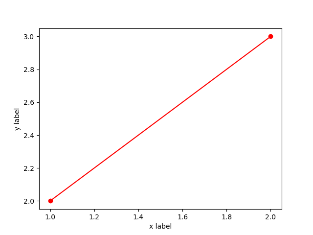

# Examples of how to use cxxplot

## Link cxxplot using CMake

To link cxxplot in your cmake project after installing cxxplot use the following CMake code

```bash
find_package(Python3 COMPONENTS Development NumPy)
find_package(cxxplot REQUIRED)
target_link_libraries(your_target PRIVATE cxxplot::cxxplot Python3::Python Python3::NumPy)
```

## Code examples

C++ source code examples can be found in the examples folder in the main repository directory.

### Simple plot example

The example below plots a simple line using integer numbers with red color and a specific marker type.

```c++
#include "cxxplot.hpp"
int main()
{
    std::vector<std::pair<std::string, std::string>> args;
    args.emplace_back("color", "r");
    args.emplace_back("marker", "o");
    
    std::vector<int> x_int{1, 2};
    std::vector<int> y_int{2, 3};
    
    cxxplot::Plot<int> plot_int(x_int, y_int, args);
    plot_int.set_xlabel("x label");
    plot_int.set_ylabel("y label");
    plot_int.show_plot();
}
```

To build this example on Ubuntu with CMake store the code in a file called plot_example.cpp and use the following CMakeLists.txt file

```cmake
cmake_minimum_required(VERSION 3.15.3)
find_package(Python3 COMPONENTS Development NumPy)
find_package(cxxplot REQUIRED)
add_executable(plot_example)
target_sources(plot_example PRIVATE plot_example.cpp)
target_link_libraries(plot_example PRIVATE cxxplot::cxxplot Python3::Python Python3::NumPy)
```

then use the following in the directory with the CMakeLists.txt and plot_example.cpp to build and run the example

```bash
cmake .
make
./plot_example
```

After running the result a window should appear on the screen with the plot below

